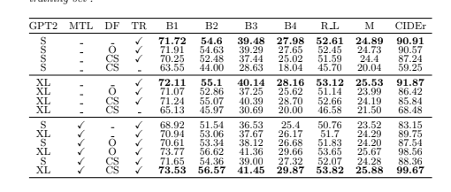
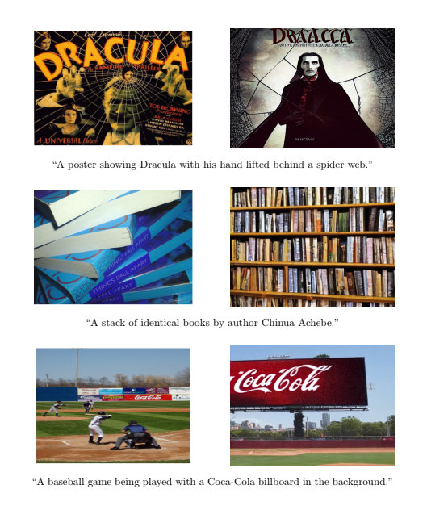
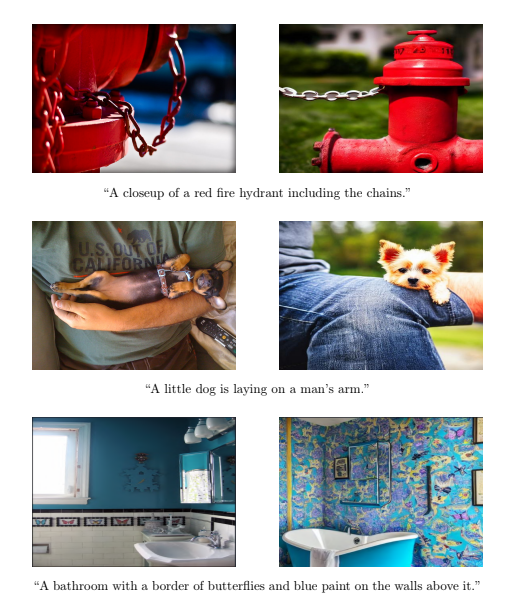
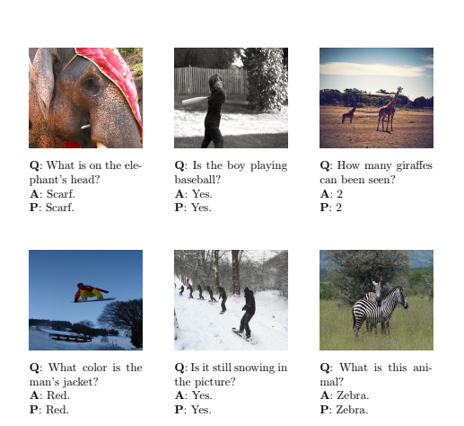
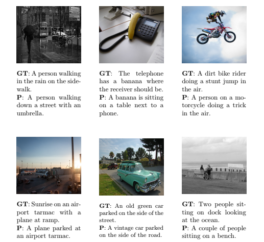

# Enhancing and unifying Vision-Language tasks with Diffusion models

## Abstract
In computer vision, image captioning is a challenging task, in which the goal
is to bridge the gap between visual content and natural language understand-
ing. Image captioning, as the name suggests, is the process where a descriptive
caption is automatically generated from an image. Another challenging task
is visual question answering, where a user can ask questions about an image
and receive meaningful answers. In recent years, there is a lot of effort in the
research community to improve both processes, by introducing different archi
tectures and methods. Image captioning and visual question answering are two
very related vision-language tasks. However, they are treated individually.
In this thesis, we follow a lightweight approach for image captioning and we
made a thorough investigation of all its components. We then extend that
method to handle visual question answering tasks. Finally, we introduce a
unified model, which is trained via multitask learning on both image captioning
and visual question answering. This single model can handle both tasks at
inference, achieving competitive performance in both. Surprisingly, although
multitask learning often leads to inferior performance in the individual tasks, in
our case it even improves performance.
In another direction, we employ the power of diffusion generative models to
boost the performance of our image captioning and visual question answering
models. Using diffusion, we generate images from the existing captions of each
training set to create new, synthetic datasets. By controlling each generated
image to be similar to the existing one corresponding to the caption, we verify
that the synthetic datasets can assist to improve the performance of captioning,
as well as visual question answering in the presence of multitask learning.

## Diffusion - Clipscore
With the assistance of the diffusion models we can create synthetic datasets that can boost the model's predictive power
we generate five candidate images corresponding to a textual input. The Clipscore for each generated image 
is computed as the cosine similarity between its CLIP embeddings and the original caption. 
Ultimately, the image with the highest Clipscore value is chosen.
The main Stable diffusion model that we employed in our process is the “Compvis/stable-diffusion-v1-4”.

## Ablation
In our ablation study we explore all the aspects of our architecture.
Our key elements are Multi Task learning, Diffusion Approach and the size of the Decoder.

## Results

**Synthetic Images based on training captions**:

  

  

**VQA & Captioning results generated by MTL CS model**:

  

  

